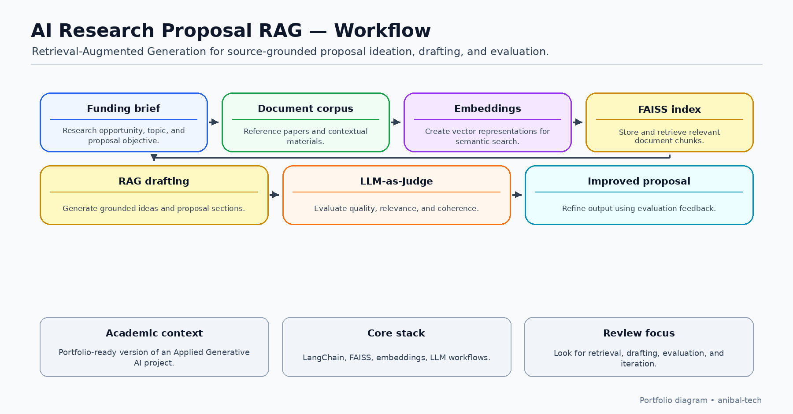

# AI Research Proposal RAG Assistant


RAG-based AI workflow for research proposal automation using LangChain, FAISS, embeddings, and LLM-as-Judge evaluation.

The project demonstrates how Retrieval-Augmented Generation (RAG), semantic search, prompt engineering, and AI-assisted evaluation can support research proposal development while maintaining human review and responsible AI practices.



---

# Best way to review this repository

Recommended review order:

1. Academic Context
2. Result
3. Business Problem
4. Workflow Diagram
5. Repository Structure
6. Project Files
7. Documentation
8. Prompt Templates
9. Responsible AI
10. What I Learned

This repository is intended to be reviewed as a complete AI workflow rather than as an isolated notebook.

---

# Academic Context

This repository presents a portfolio-ready version of a project developed during the **Applied Generative AI certification program from Johns Hopkins University**.

The implementation has been reviewed and sanitized for public visibility.

It does **not** include:

- private course materials
- proprietary content
- credentials
- API keys
- tokens
- copyrighted research papers
- confidential datasets

---

# Result

This project received a final score of **40 / 40**.

Evaluator feedback highlighted:

- Correct LLM setup
- Clear prompt engineering
- Strong relevance assessment
- Coherent proposal ideation
- Structured proposal generation
- Systematic evaluation
- Meaningful summary recommendations

---

# Business Problem

Preparing competitive research proposals requires reviewing funding opportunities, identifying relevant literature, generating proposal ideas, drafting structured content, and validating alignment with evaluation criteria.

This process is usually manual, time-consuming, and difficult to standardize.

This project explores how Generative AI can reduce manual effort by combining:

- Retrieval-Augmented Generation (RAG)
- Semantic search
- Prompt engineering
- LLM-based evaluation
- Iterative proposal refinement

---

# Project Objective

The objective is to demonstrate a complete AI-assisted workflow capable of:

- Analyzing a funding opportunity
- Identifying the core research topic
- Retrieving relevant research papers
- Generating proposal ideas
- Drafting a structured proposal
- Evaluating proposal quality
- Improving the proposal through an LLM-based revision loop

---

# Workflow

## High-Level Workflow

```text
Funding Opportunity
        ↓
Topic Extraction
        ↓
Research Paper Processing
        ↓
Embeddings
        ↓
FAISS Index
        ↓
Semantic Retrieval
        ↓
Proposal Ideation
        ↓
Proposal Draft
        ↓
LLM-as-Judge Evaluation
        ↓
Revision Loop
        ↓
Final Proposal
```

## Detailed Workflow

1. Load funding opportunity
2. Extract research topic
3. Load research papers
4. Split documents into chunks
5. Generate embeddings
6. Store vectors in FAISS
7. Retrieve relevant papers
8. Assess paper relevance
9. Generate proposal ideas
10. Select strongest idea
11. Draft proposal
12. Evaluate proposal using LLM-as-Judge
13. Revise proposal
14. Generate executive summary

---

# Selected Proposal Idea

**Leveraging Social Media Dynamics for Personalized Digital Mental Health Interventions Among Young Adults**

The proposal was selected because it aligned strongly with the funding opportunity while remaining grounded in retrieved research literature.

---

# Key Capabilities

- Funding opportunity analysis
- Research paper ingestion
- Embedding generation
- FAISS vector search
- Semantic retrieval
- Proposal ideation
- Proposal drafting
- Proposal evaluation
- Revision loop
- Executive summary generation

---

# Technologies Used

## Programming

- Python
- Google Colab

## AI Frameworks

- LangChain
- OpenAI-compatible LLM API

## Retrieval

- FAISS
- HuggingFace Embeddings

## Document Processing

- PyPDF
- Pandas

## AI Techniques

- Retrieval-Augmented Generation (RAG)
- Prompt Engineering
- LLM-as-Judge Evaluation

---

# Repository Structure

```text
ai-research-proposal-rag/
│
├── assets/
├── docs/
├── notebooks/
├── outputs/
├── prompts/
└── README.md
```

---

# Project Files

| File | Description |
|------|-------------|
| notebooks/rag_research_proposal_automation.ipynb | Editable notebook |
| outputs/final_project_report.html | Executed notebook report |
| outputs/sample_generated_proposal.md | Sample generated proposal |

---

# Documentation

Additional documentation:

- project-overview.md
- methodology.md
- architecture-overview.md
- evaluation-summary.md

---

# Prompt Templates

The prompts folder contains sanitized examples for:

- Topic extraction
- Paper relevance assessment
- Proposal ideation
- Proposal generation
- Proposal evaluation

These prompts demonstrate prompting strategies without redistributing proprietary academic material.

---

# Responsible AI

This repository follows a human-in-the-loop approach.

AI supports:

- Retrieval
- Proposal drafting
- Evaluation
- Improvement

Final decisions remain under human supervision.

The repository intentionally excludes:

- API keys
- Tokens
- Credentials
- Proprietary course material
- Copyrighted papers
- Confidential datasets
- Private funding opportunities

---

# What I Learned

This project reinforced the importance of:

- Retrieval-Augmented Generation
- Prompt engineering
- LLM evaluation
- Semantic search
- Human-in-the-loop workflows
- Responsible AI
- Secure handling of sensitive information
- Portfolio-oriented documentation

---

# Potential Improvements

Future versions may include:

- Hybrid retrieval
- Metadata-aware search
- Citation extraction
- Improved grounding
- Multi-step revision loops
- Human expert review
- Streamlit interface
- FastAPI deployment
- Quality dashboards
- Advanced retrieval filters
- Knowledge-base integration

---

# Portfolio Relevance

This repository demonstrates experience in:

- Applied Generative AI
- Retrieval-Augmented Generation
- Document Intelligence
- Semantic Search
- Prompt Engineering
- AI-assisted Decision Support
- LLM Evaluation
- Research Automation
- Workflow Orchestration
- Responsible AI

---

# Status

**Public portfolio version**

This repository is part of my professional GitHub portfolio.

It will continue evolving as additional documentation, evaluation techniques, deployment examples, and workflow improvements are added.

---

# Responsible Use Disclaimer

This repository is intended exclusively for educational and portfolio purposes.

It demonstrates an AI-assisted workflow for research proposal development and should not replace expert scientific, legal, ethical, clinical, or grant-writing review.

---

# Author

**Anibal Arias**

Technology Development Manager  
Technical Leadership • Software Delivery • Applied Generative AI • RAG Workflows

GitHub: https://github.com/anibal-tech

LinkedIn: https://www.linkedin.com/in/anibal-arias
